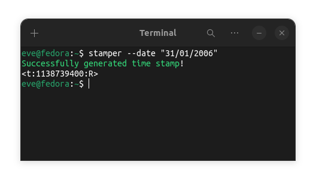

# Stamper

Simple cli tool for creating discord timestamps

## Usage



```
stamper version 1.0.0
  -date string
    	The date for the stamp. (dd/mm/yyyy) (required) (default "nil")
  -time string
    	The time for the stamp. (hr:min)     (optional) (default "20:30")
  -type string
    	The type for the stamp.              (optional) (default "relative")

Possible types: (relative, short time, long time, short date, long date, short date time)
```

## Installation
To install stamper you must have `git` and `golang` installed on your machine.
```bash
git clone https://github.com/its-Lyn/stamper
cd stamper

./install.sh
```
If `install.sh` doesn't work at first, try to run `chmod +x ./install.sh` first.

<br>

Uninstall stamper by running `./install.sh --remove`

### License
MIT